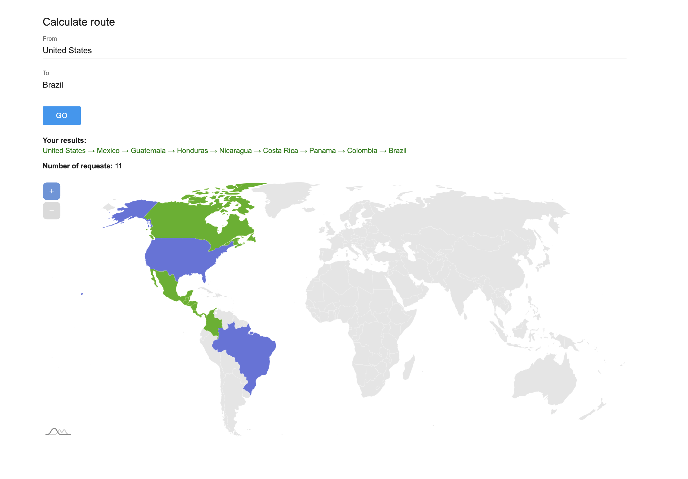

# Land Route Calculator

This project calculates the land route from one country to another using the [Rest Countries API](https://restcountries.com/#api-endpoints-v3), making the minimum number of requests. The code operates asynchronously and retrieves data about each country via the country code (cca3).

Check the [Live Demo](https://ark-web-dev.github.io/route-calculator/)



## Stack


## Description

The Land Route Calculator determines the shortest path between two countries by traversing through their neighboring countries. Utilizing the Rest Countries API, it fetches and processes only the necessary data fields to optimize the number of API requests.

## Features

-   Asynchronous API requests
-   Display the route between two countries
-   Handle errors and edge cases such as invalid country codes or unreachable countries
-   Limit the route search to 10 steps to avoid excessive requests

## How to Use

1. Enter the source country and destination country.
2. The output will display the countries to pass through to reach the destination, along with the number of requests made.

## Example

Input: Austria and Bulgaria  
Output:

```
Austria → Hungary → Serbia → Bulgaria
Austria → Hungary → Romania → Bulgaria

Number of requests: X
```

## Error Handling

-   Invalid country code: Displays an error message when the API returns an error for an invalid country code.
-   Unreachable countries: Handles cases where there is no land route between the countries or the route exceeds 10 steps.

## Future Enhancements

-   Improve UI with additional design elements.
-   Add more detailed information about each country on the route.
-   Optimize the algorithm for better performance.

## Contributing

Feel free to fork this repository and submit pull requests. For major changes, please open an issue first to discuss what you would like to change.

This project aims to provide a practical demonstration of working with APIs in a TypeScript environment while solving an interesting routing problem. Feel free to explore, modify, and enhance the code as per your requirements.
